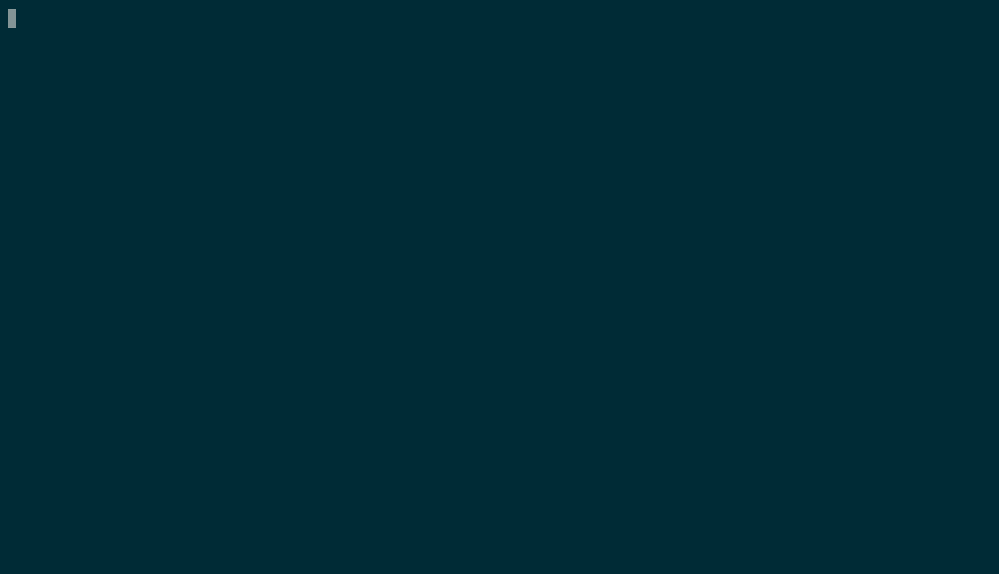

# gh-co.nvim


*Observe messages in bottom panel to see the codeowners of the file*

[Github CODEOWNERS](https://docs.github.com/en/repositories/managing-your-repositorys-settings-and-features/customizing-your-repository/about-code-owners) plugin for neovim. This plugin will help you identify code ownership for the files you are editing or you can identify the owners in your Git history.

## Installation

The plugin has standard structure so any method should work fine.

### [`lazy.nvim`](https://github.com/folke/lazy.nvim)

```lua
-- ~/.config/nvim/lua/plugins/gh-co.lua
return {
  "comatory/gh-co.nvim",
  config = function()
     vim.keymap.set("n", "<leader>gg", ":GhCoWho<CR>", {})
  end
}
```

### [`vim.plug`](https://github.com/junegunn/vim-plug)

`Plug 'comatory/gh-co.nvim'`

## Quick start

1. Open repository that has `CODEOWNERS` file. Check that it's accessible using `:GhCoShowFile`.
2. Open a file, run `:GhCoWho`. You will see codeowner(s) in the bottom panel as a message.
3. Open few different files with different owners, run `:GhCoWhos`, a new buffer with all the codeowners will be shown.
4. Get a git commit SHA from the repository history, run `:GhCoGitWho <sha>` to get a list of codeowners which affected given commit.

## Features

* show codeowner for currently opened file
* show codeowners for all opened buffers
* show codeowners for specific git commit via SHA
* locate & open CODEOWNERS file
* syntax highlighting for CODEOWNERS files

## API

The plugin exposes several commands prefixed with `GhCo*`. There are no default key bindings for running these so it's up to you to configure it.

### `:GhCoHealthcheck`

Show whether plugin is running OK.

### `:GhCoStatus`

Shows plugin configuration.

### `:GhCoShowFile`

Open CODEOWNERS file in a buffer.

### `:GhCoWho`

Show codeowners for file in an active buffer.

### `:GhCoWhos`

Show codeowners for files in all buffers.

### `:GhCoGitWho <SHA>`

Show codeowners for files affected by commit SHA.

## Development

Project is using luarocks to manage dependencies. After cloning the repo run:

```bash
luarocks install --deps-only gh-co.nvim-0.0.5-1.rockspec
```

### Lint

Run `PATH="./lua_modules/bin:PATH" luacheck lua` to lint the codebase

### Test

Run `luarocks test`
